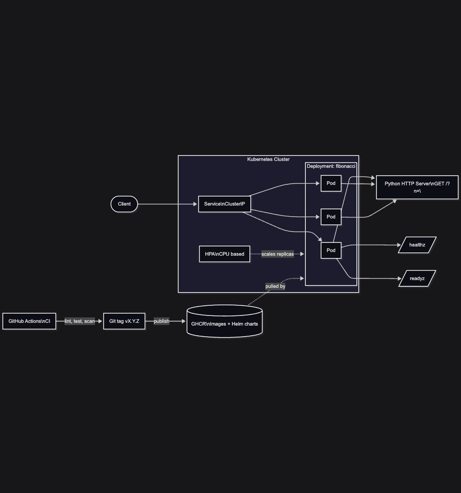

# Fibonacci Web App – Architecture Overview

## Purpose

This project demonstrates how a small, deterministic Python service can be packaged and delivered using production‑grade platform practices. While the business logic is intentionally simple (Fibonacci sequence generation), the surrounding architecture mirrors what you would expect for a real microservice deployed in Kubernetes.

The goal is to show correctness, operability, and delivery maturity rather than application complexity.

---

---

## High‑Level Architecture

**Client → Kubernetes Service → Fibonacci Pods → Response**

1. A client sends an HTTP request with a query parameter `n`.
2. Kubernetes routes traffic through a ClusterIP Service.
3. One of the Fibonacci pods handles the request.
4. The pod computes the Fibonacci sequence and returns the response.

The service is fully stateless, making it safe to scale horizontally.

---

## Application Layer

### Python HTTP Service

* Built using Python standard library `http.server`.
* Exposes a single read‑only endpoint:

  * `GET /?n=<int>`
* Exposes operational endpoints:

  * `/healthz` – liveness probe
  * `/readyz` – readiness probe

### Key Characteristics

* Stateless and deterministic
* Input validation and bounds enforcement
* No shared state or storage
* Environment‑driven configuration

### Configuration

| Variable | Purpose                          | Default |
| -------- | -------------------------------- | ------- |
| `PORT`   | HTTP listen port                 | `8000`  |
| `MAX_N`  | Maximum allowed Fibonacci length | `10000` |

---

## Containerization

### Docker Image

* Base image: `python:3.13-slim`
* Non‑root execution via `appuser`
* Minimal runtime dependencies
* Single process per container

### Image Responsibilities

* Run exactly one HTTP server
* Expose port 8000
* Emit logs to stdout

The image is immutable and environment‑agnostic.

---

## Kubernetes Deployment

### Deployment

* Manages pod replicas
* Defines resource requests and limits
* Configures liveness and readiness probes
* Injects configuration via environment variables

### Service

* Type: `ClusterIP`
* Routes traffic to healthy pods only
* Uses label selectors shared with the Deployment

---

## Autoscaling

### Horizontal Pod Autoscaler (HPA)

* Scales pods based on CPU utilization
* Default target: 70% average CPU usage
* Configurable min and max replicas

The service is CPU‑bound and stateless, making it a good candidate for horizontal scaling.

---

## Continuous Integration

### CI Pipeline (GitHub Actions)

Runs on pull requests and main branch pushes:

* Helm lint and template rendering
* Python unit tests
* Docker image build
* Container vulnerability scanning

Invalid manifests, failing tests, or critical vulnerabilities block the pipeline.

---

## Release Process

### Trigger

* Git tag following `vX.Y.Z` pattern

### Release Actions

1. Build and push Docker image to GHCR
2. Scan pushed image for vulnerabilities
3. Package Helm chart
4. Publish Helm chart as OCI artifact to GHCR
5. Verify the published chart can be pulled and rendered

This ensures release artifacts are deployable and secure.

---

## Observability and Operations

### Health Checks

* Liveness: process health
* Readiness: traffic eligibility

### Logs

* Standard output
* Compatible with Kubernetes logging systems

### Failure Modes

* Invalid input returns client errors
* Pod restarts handled automatically by Kubernetes
* Traffic routed only to ready pods

---

## Design Principles Demonstrated

* Separation of concerns
* Configuration over hard‑coding
* Immutable infrastructure
* Declarative deployments
* Defensive defaults
* Scalable by design

---

## Why This Architecture

This architecture intentionally mirrors real‑world platform patterns:

* Simple services packaged with strong delivery pipelines
* Kubernetes primitives used correctly and minimally
* Automation that prevents invalid releases

It demonstrates how even small services benefit from disciplined platform engineering.
